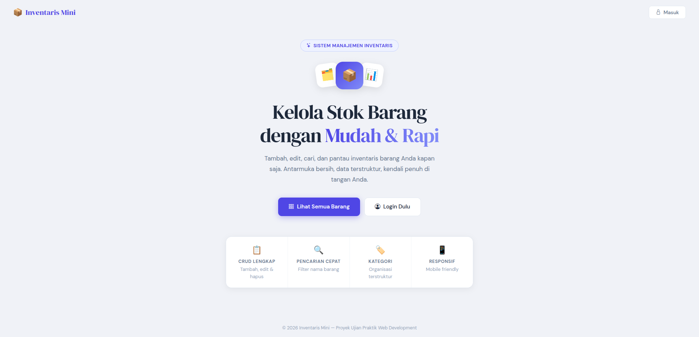
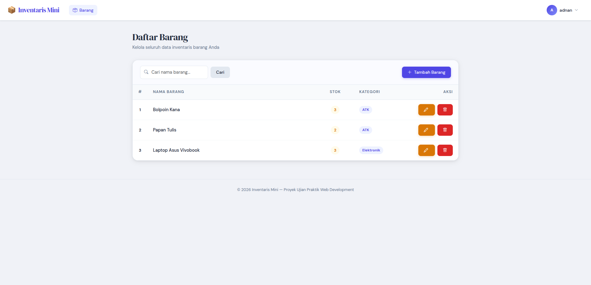
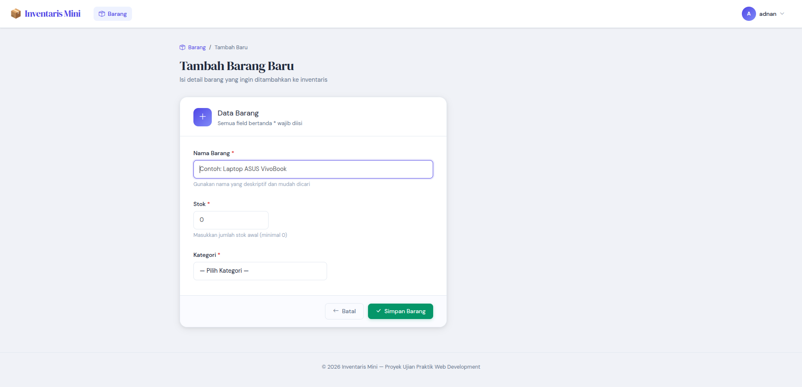
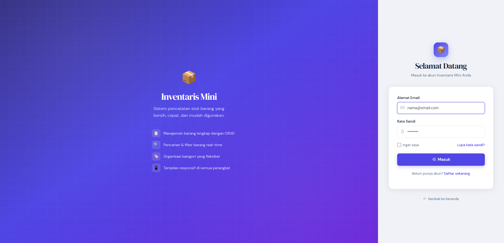

# 📦 Sistem Inventaris Mini

Aplikasi web sederhana untuk mengelola data inventaris barang, dibangun menggunakan **Laravel 11** dan **MySQL/MariaDB**. Proyek ini dikerjakan sebagai bagian dari Ujian Praktik Web Development dengan fokus pada pengelolaan relasi database (One-to-Many) dan implementasi antarmuka yang bersih, modern, serta responsif.

[Laravel](https://img.shields.io/badge/Laravel-11.x-FF2D20?logo=laravel)
[PHP](https://img.shields.io/badge/PHP-8.1+-777BB4?logo=php)
[Bootstrap](https://img.shields.io/badge/Bootstrap-5.3-7952B3?logo=bootstrap)
[MySQL](https://img.shields.io/badge/MySQL-8.0-4479A1?logo=mysql)


---

## 🎯 Fitur Utama

- **CRUD Lengkap** – Tambah, lihat, edit, dan hapus data barang.
- **Relasi Kategori** – Setiap barang terhubung dengan kategori melalui dropdown dinamis.
- **Pencarian Real-time** – Filter barang berdasarkan nama secara instan.
- **Validasi Input** – Form tidak dapat dikirim jika ada data yang kosong atau tidak valid.
- **Sistem Login** (opsional) – Akses aman menggunakan Laravel Breeze (login, register, lupa password).
- **Tampilan Modern** – Desain bersih dengan Bootstrap 5, Google Fonts, dan ikon Bootstrap Icons.
- **Responsif** – Nyaman digunakan di desktop maupun perangkat mobile.

---

## 🖼️ Tangkapan Layar

| Halaman | Preview |
|--------|---------|
| Beranda |  |
| Daftar Barang |  |
| Form Tambah |  |
| Halaman Login |  |


---

## 🗃️ Struktur Database

Proyek menggunakan dua tabel utama dengan relasi One-to-Many:

**Tabel `categories`**
| Kolom | Tipe | Keterangan |
|-------|------|------------|
| id | bigint (PK) | Primary key |
| nama_kategori | varchar | Nama kategori |
| created_at | timestamp | Waktu dibuat |
| updated_at | timestamp | Waktu diperbarui |

**Tabel `items`**
| Kolom | Tipe | Keterangan |
|-------|------|------------|
| id | bigint (PK) | Primary key |
| nama_barang | varchar | Nama barang |
| stok | int | Jumlah stok |
| kategori_id | bigint (FK) | Foreign key ke categories.id |
| created_at | timestamp | Waktu dibuat |
| updated_at | timestamp | Waktu diperbarui |

---

## 🛠️ Teknologi yang Digunakan

- **Backend:** Laravel 11, PHP 8.1+
- **Database:** MySQL / MariaDB
- **Frontend:** Blade templating, Bootstrap 5, Bootstrap Icons
- **Font:** DM Sans & DM Serif Display (Google Fonts)
- **Autentikasi (opsional):** Laravel Breeze (Blade)

---

## 🚀 Cara Menjalankan Proyek

### Prasyarat
- PHP >= 8.1
- Composer
- MySQL / MariaDB
- Node.js & NPM (opsional, jika menggunakan Vite/Breeze)

### Langkah-langkah

1. **Clone repositori**
   ```bash
   git clone https://github.com/username/inventaris-mini.git
   cd inventaris-mini
   ```

2. **Instal dependensi PHP**
   ```bash
   composer install
   ```

3. **Konfigurasi environment**
   - Salin file `.env.example` menjadi `.env`
   - Sesuaikan pengaturan database:
     ```env
     DB_DATABASE=inventaris_db
     DB_USERNAME=root
     DB_PASSWORD=
     ```

4. **Generate application key**
   ```bash
   php artisan key:generate
   ```

5. **Jalankan migrasi dan seeder**
   ```bash
   php artisan migrate --seed
   ```
   > Seeder akan mengisi beberapa data kategori awal (Elektronik, ATK, Olahraga, Dapur).

6. **Instal dan build frontend**
   ```bash
   npm install && npm run dev
   ```

7. **Jalankan server lokal**
   ```bash
   php artisan serve
   ```

8. **Buka browser** di `http://localhost:8000`

### Login
- Klik **Register** untuk membuat akun baru,

---

## 📁 File SQL

File `database.sql` tersedia di root repositori. Anda dapat mengimpornya langsung ke MySQL/MariaDB untuk mendapatkan struktur dan data awal tanpa menjalankan migrasi.

```bash
mysql -u root -p inventaris_db < database.sql
```

---

## 📂 Struktur Folder Penting

```
inventaris-mini/
├── app/
│   ├── Http/Controllers/ItemController.php
│   └── Models/
│       ├── Item.php
│       └── Category.php
├── database/
│   ├── migrations/
│   ├── seeders/
│   └── database.sql
├── resources/views/
│   ├── layouts/
│   │   ├── app.blade.php
│   │   └── guest.blade.php
│   ├── items/
│   │   ├── index.blade.php
│   │   ├── create.blade.php
│   │   └── edit.blade.php
│   ├── auth/
│   │   ├── login.blade.php
│   │   ├── register.blade.php
│   │   └── ...
│   └── welcome.blade.php
├── routes/
│   └── web.php
└── README.md
```

---

## ✨ Poin Plus yang Diimplementasikan

- [x] Fitur Edit dan Hapus barang
- [x] Sistem Login sederhana (register, login, logout)
- [x] Tampilan antarmuka yang bersih, modern, dan responsif
- [x] Validasi form dengan pesan error yang informatif
- [x] Paginasi pada daftar barang
- [x] Styling konsisten di seluruh halaman

---

## 📝 Lisensi

Proyek ini bersifat open-source dan tersedia di bawah [lisensi MIT](LICENSE).

---

## 👨‍💻 Tentang Proyek

Proyek ini dibuat untuk memenuhi **Ujian Praktik Web Development** dengan fokus pada pengelolaan relasi database One-to-Many. Semua kode sumber, struktur database, dan dokumentasi disediakan secara lengkap agar dapat di-review dan dijalankan dengan mudah.

---

Dibuat dengan ❤️ menggunakan Laravel  
© 2026 Adnan Tri Handoko

---
